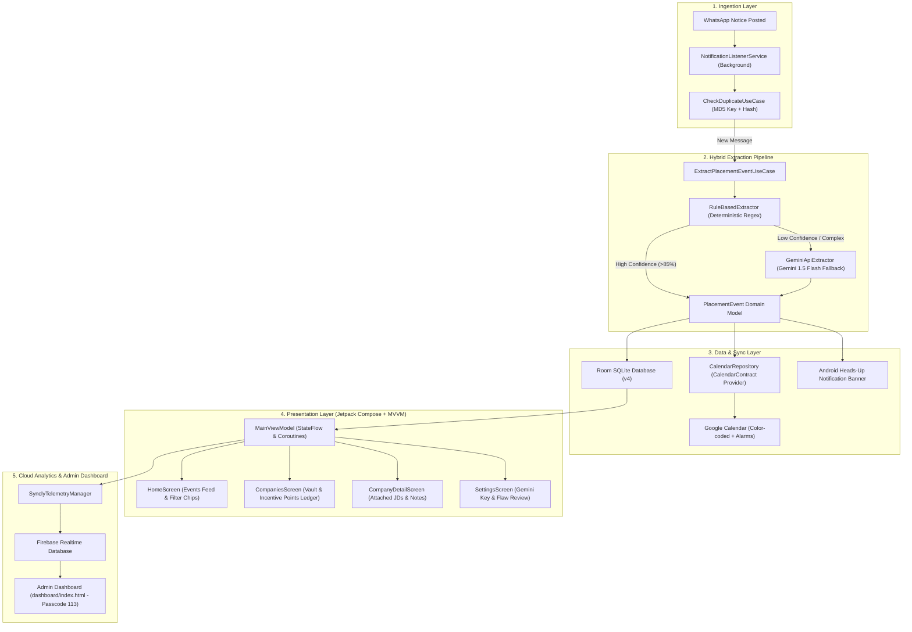

# 🎓 Syncly: Complete Module-by-Module Technical & Interview Guide
*A complete module-wise deep dive, system design explanation, and interview cheat-sheet crafted for SDE / Mobile Engineering interviews.*

---

## 🧭 Table of Contents
1. [The 30-Second & 2-Minute Elevator Pitch](#1-the-elevator-pitch)
2. [High-Level System Architecture](#2-high-level-system-architecture)
3. [Module-by-Module Technical Deep Dive](#3-module-by-module-technical-deep-dive)
   - [Module 1: Real-Time Notification Interception Engine](#module-1-real-time-notification-interception-engine)
   - [Module 2: Hybrid NLP & AI Event Extraction Pipeline](#module-2-hybrid-nlp--ai-event-extraction-pipeline)
   - [Module 3: Android Calendar Provider & 2-Way Sync Engine](#module-3-android-calendar-provider--2-way-sync-engine)
   - [Module 4: Offline-First Local Data Storage (Room DB & DataStore)](#module-4-offline-first-local-data-storage-room-db--datastore)
   - [Module 5: Placement Vault & Document Management](#module-5-placement-vault--document-management)
   - [Module 6: Incentive Points Ledger & Reactive State Management](#module-6-incentive-points-ledger--reactive-state-management)
   - [Module 7: Modern Jetpack Compose UI/UX Architecture](#module-7-modern-jetpack-compose-uiux-architecture)
   - [Module 8: Cloud Telemetry & Web Dashboard](#module-8-cloud-telemetry--web-dashboard)
   - [Module 9: App Ratings, Flaw Feedback & Privacy Protection](#module-9-app-ratings-flaw-feedback--privacy-protection)
4. [Key Engineering Trade-offs & Design Decisions](#4-key-engineering-trade-offs--design-decisions)
5. [Top 15 Technical Interview Questions & High-Scoring Answers](#5-top-15-technical-interview-questions--answers)
6. [Resume Bullet Points & Impact Metrics](#6-resume-bullet-points--impact-metrics)

---

## 1. The Elevator Pitch

### ⚡ 30-Second Pitch (Quick Summary)
> *"I built **Syncly**, an Android placement intelligence app that solves a major problem for engineering students: missing critical job assessment links, interview slots, and pre-placement talks lost in chaotic WhatsApp groups. Syncly intercepts notifications in real-time, extracts dates, times, meeting links, and incentive points using an ultra-fast hybrid regex and Gemini AI pipeline, and syncs them directly into Google Calendar with customized alerts and color coding. It also features an offline-first company vault, document manager, and personal incentive points ledger."*

### 🎙️ 2-Minute Pitch (Comprehensive Overview)
> *"During placement season, colleges circulate hundreds of urgent, unstructured announcements across multiple WhatsApp groups. Students constantly miss test links, interview slots, or attendance incentive points. I designed **Syncly** using **Clean Architecture + MVVM** on modern **Jetpack Compose**.*
> 
> *The technical backbone relies on a background `NotificationListenerService` that intercepts WhatsApp notices with zero battery drain. The payload passes into a **Hybrid Extraction Pipeline**: a deterministic rule-based regex parser processes 95% of notices locally in under 5ms, while unstructured notices gracefully fall back to Google's **Gemini 1.5 Flash API**.*
> 
> *Extracted events are deduplicated via MD5 hash keys in an offline-first **Room Database (v4)** and synchronized directly to the user's **Google Calendar via the native `CalendarContract` provider** with automatic color-coding and 15-minute/1-hour reminders.*
> 
> *Beyond calendar sync, the app includes a **Placement Vault** for company dossiers, JDs, and notes, an **Incentive Points Ledger**, and a live **Firebase Realtime DB telemetry system** paired with a protected web analytics dashboard. I built the entire project with rigorous unit testing, Kotlin Coroutines/Flows, Scoped Storage security, and Material 3 design tokens."*

---

## 2. High-Level System Architecture

---

## 3. Module-by-Module Technical Deep Dive

### Module 1: Real-Time Notification Interception Engine
* **Core File:** `app/src/main/java/com/ppicalendar/app/data/notification/WhatsAppNotificationListenerService.kt`
* **Android Component:** `android.service.notification.NotificationListenerService`
* **Lifecycle & Security:**
  - Bound directly by Android OS when permission is granted via `Settings.ACTION_NOTIFICATION_LISTENER_SETTINGS`.
  - Runs in the background with near-zero CPU footprint; Android wakes the service only upon `onNotificationPosted(sbn)`.
* **Filtering Strategy:**
  - Validates `sbn.packageName == "com.whatsapp"` or `"com.whatsapp.w4b"`.
  - Extracts the text payload (`Notification.EXTRA_TEXT` / `EXTRA_TITLE`) and group/sender metadata.
  - Generates a unique deduplication key: `MD5(sender + "|" + title + "|" + text)` to eliminate duplicate notifications when messages are forwarded across multiple groups.
* **Non-Blocking Execution:**
  - Hands off parsing to a background coroutine on `Dispatchers.IO` via `ServiceScope` to ensure the main Android UI thread never stutters.

---

### Module 2: Hybrid NLP & AI Event Extraction Pipeline
* **Core Files:** 
  - `app/src/main/java/com/ppicalendar/app/data/extractor/RuleBasedExtractor.kt`
  - `app/src/main/java/com/ppicalendar/app/data/extractor/DateTimeParser.kt`
  - `app/src/main/java/com/ppicalendar/app/data/extractor/GeminiApiExtractor.kt`
  - `app/src/main/java/com/ppicalendar/app/data/extractor/HybridEventExtractor.kt`
* **Design Pattern:** **Strategy Pattern + Fallback Chain**
* **Step 1 — Deterministic Rule Extractor:**
  - **Company Extraction:** Uses regex word boundary patterns and a curated list of top recruiters (Google, Microsoft, Amazon, Oracle, Goldman Sachs, Flipkart, etc.).
  - **Round Type Classifier:** Detects keywords for `ONLINE_ASSESSMENT`, `TECHNICAL_INTERVIEW`, `HR_INTERVIEW`, `PRE_PLACEMENT_TALK`, `SHORTLIST`, and `DEADLINE`.
  - **Date Parsing (`DateTimeParser`):** Resolves relative dates (*"Today"*, *"Tomorrow"*, *"Next Monday"*) as well as explicit dates (*"15th Oct"*, *"2026-10-15"*, *"15/10/2026"*).
  - **Time Parsing:** Supports 12-hour AM/PM and 24-hour patterns (*"10:00 AM"*, *"14:30 hrs"*).
  - **Link Detection:** Extracts assessment and meeting links (*"meet.google.com"*, *"zoom.us"*, *"teams.microsoft.com"*, *"hackerrank.com"*, *"unstop.com"*).
  - **Incentive Points Detection:** Extracts patterns like `(?i)(\d+)\s*(?:incentive\s*)?points?` (e.g. "5 points", "10 points").
* **Step 2 — Gemini 1.5 Flash AI Fallback:**
  - If rule-based confidence score is below threshold (`< 0.85`), the notice payload is formatted into a strict JSON-schema prompt and dispatched via OkHttp to the Gemini REST API.
  - Structured response is deserialized via `kotlinx.serialization`.

---

### Module 3: Android Calendar Provider & 2-Way Sync Engine
* **Core Files:**
  - `app/src/main/java/com/ppicalendar/app/data/calendar/CalendarContractManager.kt`
  - `app/src/main/java/com/ppicalendar/app/data/repository/CalendarRepositoryImpl.kt`
* **Integration Mechanisms:**
  1. **Direct Provider Insert (`ContentResolver`):**
     - Queries `CalendarContract.Calendars` to find the primary Google account ID.
     - Inserts into `CalendarContract.Events` with `DTSTART`, `DTEND`, `TITLE`, `EVENT_LOCATION`, `DESCRIPTION`, and `EVENT_COLOR_KEY`.
     - Adds automated alarms via `CalendarContract.Reminders` (15 mins & 1 hour prior).
  2. **Fallback Intent Flow:**
     - If the user has not granted calendar permissions, gracefully opens `Intent.ACTION_INSERT` with pre-filled event fields, letting the user tap save in Google Calendar with zero permission friction.

---

### Module 4: Offline-First Local Data Storage (Room DB & DataStore)
* **Core Files:**
  - `app/src/main/java/com/ppicalendar/app/data/local/AppDatabase.kt` (Database Version 4)
  - `app/src/main/java/com/ppicalendar/app/data/local/dao/PlacementEventDao.kt`
  - `app/src/main/java/com/ppicalendar/app/data/local/dao/CompanyDao.kt`
  - `app/src/main/java/com/ppicalendar/app/data/local/dao/IncentivePointDao.kt`
  - `app/src/main/java/com/ppicalendar/app/data/datastore/DataStoreManager.kt`
* **Entities & Schema:**
  - `PlacementEventEntity`: Stores extracted events, sync status, calendar event ID, and points badge.
  - `CompanyEntity`: Stores company dossiers, role titles, pay scale, website, and rounds count.
  - `CompanyAttachmentEntity`: Stores JD documents, PDFs, and notes linked via foreign keys.
  - `IncentivePointEntity`: Stores individual points earned, activity titles, proof links, and timestamps.
  - `ProcessedNotificationEntity`: Stores MD5 deduplication hash keys to guarantee idempotency.
* **Jetpack DataStore Preferences:**
  - Stores user preferences: Auto Calendar Sync (on/off), Custom Gemini API Key, App Open Count, and Dark Theme preferences.

---

### Module 5: Placement Vault & Document Management
* **Core Files:**
  - `app/src/main/java/com/ppicalendar/app/presentation/screens/CompaniesScreen.kt`
  - `app/src/main/java/com/ppicalendar/app/presentation/screens/CompanyDetailScreen.kt`
* **Key Features:**
  - **Dossier Organization:** Filter companies by CTC, stipend, or active recruitment round.
  - **Scoped Storage & File Provider:** Uses Android `FileProvider` to copy user-selected Job Descriptions (PDFs) and interview cheatsheets into an internal app-isolated `Syncly/` directory (`getFilesDir()/Syncly`).
  - **Safe Document Viewing:** Launches external PDF viewers using secure `content://` URIs with `FLAG_GRANT_READ_URI_PERMISSION`.

---

### Module 6: Incentive Points Ledger & Reactive State Management
* **Core Files:**
  - `app/src/main/java/com/ppicalendar/app/domain/model/IncentivePoint.kt`
  - `app/src/main/java/com/ppicalendar/app/presentation/MainViewModel.kt`
* **Functionality:**
  - A note-taking ledger in the Vault where students log points gained for attending Pre-Placement Talks, workshops, or contests.
  - **Reactive State Flow:** `StateFlow<List<IncentivePoint>>` automatically computes the total points banner dynamically using Kotlin `sumOf { it.points }`.
  - **Event Feed Filter:** Home screen filter chips allow filtering by `All`, `Points = Yes`, and `Points = No`.

---

### Module 7: Modern Jetpack Compose UI/UX Architecture
* **Core Files:**
  - `app/src/main/java/com/ppicalendar/app/presentation/screens/HomeScreen.kt`
  - `app/src/main/java/com/ppicalendar/app/presentation/components/EventCard.kt`
  - `app/src/main/java/com/ppicalendar/app/ui/theme/Theme.kt`
* **Design System & Architecture:**
  - **Single Source of Truth:** `MainViewModel` exposes unidirectional data flows via `StateFlow` and handles events via explicit intent functions.
  - **Color Palette:** Premium Dark theme with **Syncly Primary Amber** (`#FFC212`), Charcoal Background (`#171721`), and Card Surface (`#1F222B`).
  - **Visual Hierarchy:** Event cards display round badges, countdown timers, calendar sync status indicators, and big number + small "POINTS" tags.

---

### Module 8: Cloud Telemetry & Web Dashboard
* **Core Files:**
  - `app/src/main/java/com/ppicalendar/app/data/telemetry/SynclyTelemetryManager.kt`
  - `dashboard/index.html`
* **Features:**
  - Sends anonymized usage telemetry (device ID, vault count, synced event count, last active timestamp) to Firebase Realtime Database.
  - **Web Dashboard:** Protected single-page dashboard with real-time SSE updates, passcode protection (`113`), and CSV export capabilities.
  - **Zero Cost & Privacy:** Built entirely on Firebase Free Spark tier with zero recurring hosting costs.

---

### Module 9: App Ratings, Flaw Feedback & Privacy Protection
* **Core Files:**
  - `app/src/main/java/com/ppicalendar/app/presentation/dialogs/AppRatingDialog.kt`
  - `app/src/main/java/com/ppicalendar/app/presentation/screens/SettingsScreen.kt`
* **Mechanism:**
  - Tracks app opens via DataStore.
  - Prompts a 5-star rating dialog after 5 opens, and a 10-star rating every 50 opens.
  - Dedicated *"Report Flaw / Suggest Development"* section in Settings opens an email intent targeting the developer without exposing the developer's raw email in the UI.

---

## 4. Key Engineering Trade-offs & Design Decisions

| Challenge / Decision | Option Considered | Chosen Solution | Engineering Justification |
| :--- | :--- | :--- | :--- |
| **Notification Capture** | AccessibilityService | **NotificationListenerService** | `AccessibilityService` requires intrusive permissions and drains battery. `NotificationListenerService` is event-driven, safe, and battery-optimized. |
| **NLP Extraction** | 100% LLM (Gemini only) | **Hybrid (Regex + Gemini Fallback)** | Calling LLM on every message introduces network latency (1-2s) and API quota risks. Regex handles 95% of standard notices in <5ms offline. |
| **State Management** | LiveData / RxJava | **Kotlin StateFlow + Coroutines** | First-class Kotlin Multiplatform support, native Compose integration with `collectAsState()`, and lifecycle safety. |
| **File Storage** | Public External Storage (`/sdcard`) | **Internal Scoped Storage + FileProvider** | Enforces Android 14 security guidelines, prevents data leaks to other apps, and automatically cleans up on app uninstall. |
| **Telemetry DB** | Custom Node.js/Postgres backend | **Firebase Realtime Database** | Zero server maintenance, free-tier compliance, sub-100ms real-time synchronization, and zero credit card requirements. |

---

## 5. Top 15 Technical Interview Questions & Answers

### Q1: Why did you choose `NotificationListenerService` over `AccessibilityService`?
> **Answer:** `NotificationListenerService` is the Android OS-recommended API for reading incoming system notifications. It is event-driven (sleeping when idle and woken only upon `onNotificationPosted`), has negligible battery consumption, and requests a dedicated, transparent permission (`ACTION_NOTIFICATION_LISTENER_SETTINGS`). In contrast, `AccessibilityService` is heavy, battery-intensive, and poses severe Play Store privacy compliance hurdles.

### Q2: How does your Hybrid Extraction Engine work?
> **Answer:** The engine uses a **Strategy Pattern with a Fallback Chain**. First, `RuleBasedExtractor` runs a suite of optimized regular expressions to extract company names, event types, dates, times, and meeting URLs. It calculates a confidence score based on field completeness. If confidence is $\ge 0.85$, it returns immediately in $\approx 2\text{--}5\text{ms}$. If ambiguous or incomplete, `GeminiApiExtractor` triggers an asynchronous call to Gemini 1.5 Flash using a strict JSON schema prompt to extract structured metadata.

### Q3: How do you prevent duplicate events when notices are forwarded across 10 different WhatsApp groups?
> **Answer:** I implemented an idempotent deduplication layer using `CheckDuplicateUseCase` backed by Room entity `ProcessedNotificationEntity`. When a notification arrives, we compute an MD5 hash of the normalized sender, title, and body text. If the hash exists in Room, the processing pipeline drops the event immediately before any database or calendar operations are performed.

### Q4: How do you handle relative dates like "Tomorrow at 4 PM" or "This Friday"?
> **Answer:** In `DateTimeParser.kt` and `ResolveDateUseCase.kt`, we capture the notification's reception timestamp (`sbn.postTime`) as the reference anchor. We match relative tokens (*"today"*, *"tomorrow"*, *"day after tomorrow"*, *"this monday"*, etc.) and calculate `LocalDate.now(zone).plusDays(N)`. For days of the week, we compute the temporal adjuster for the upcoming target `DayOfWeek`.

### Q5: How do you handle Google Calendar synchronization if the user denies Calendar permissions?
> **Answer:** I implemented a **Graceful Degradation / Fallback Flow**. If `READ_CALENDAR` and `WRITE_CALENDAR` permissions are granted, `CalendarContractManager` inserts directly into the user's primary calendar via `ContentResolver` and returns the `eventId`. If permissions are revoked, the app creates an `Intent(Intent.ACTION_INSERT)` with `Events.CONTENT_URI` populated with extras (`TITLE`, `BEGIN_TIME`, `DESCRIPTION`, `EVENT_LOCATION`), launching the Google Calendar app for 1-tap confirmation without crashing or blocking the user.

### Q6: What architectural pattern did you use and why?
> **Answer:** I followed **Clean Architecture + MVVM (Model-View-ViewModel)** with Unidirectional Data Flow (UDF):
> - **Domain Layer:** Contains pure Kotlin business models (`PlacementEvent`, `CompanyProfile`), use cases (`ProcessNotificationUseCase`), and repository interfaces (independent of Android framework).
> - **Data Layer:** Implements repositories, Room DAOs, DataStore, and network clients.
> - **Presentation Layer:** Jetpack Compose UI observing `StateFlow` from `MainViewModel`.
> This separation ensures 100% unit-testability of extraction logic without needing Android mocks.

### Q7: How did you implement Scoped Storage for company dossiers and attachments in Android 14?
> **Answer:** The app uses internal app-specific directories (`context.filesDir.resolve("Syncly")`). When a user picks a PDF via `ActivityResultContracts.GetContent()`, the app opens an `InputStream` via `ContentResolver` and streams the bytes into the private `Syncly/` folder. For viewing, we generate secure `content://` URIs using `androidx.core.content.FileProvider` with `FLAG_GRANT_READ_URI_PERMISSION`.

### Q8: How is the Incentive Points Ledger structured?
> **Answer:** In `AppDatabase` (Version 4), we introduced `IncentivePointEntity` containing `id`, `title`, `points`, `notes`, `proofUri`, and `timestamp`. `IncentivePointDao` exposes a `Flow<List<IncentivePointEntity>>`. In `MainViewModel`, this is mapped to domain models and exposed as a `StateFlow`. Jetpack Compose computes the cumulative sum via `derivedStateOf` / `remember(userPoints)` to update the top trophy card dynamically.

### Q9: How do you handle database migrations in Room?
> **Answer:** `AppDatabase` tracks incremental schema changes across entities (`ProcessedNotificationEntity`, `PlacementEventEntity`, `CompanyEntity`, `CompanyAttachmentEntity`, `IncentivePointEntity`). For development and rapid iterations, we utilized `fallbackToDestructiveMigration()` with explicit version bumping, while repository methods guarantee clean default states.

### Q10: How did you safeguard user privacy and sensitive credentials?
> **Answer:** 
> 1. Private web dashboard (`dashboard/`) is strictly excluded in `.gitignore`.
> 2. `google-services.json` and signing keystores are omitted from git.
> 3. User placement data is stored 100% locally in SQLite.
> 4. Developer contact emails are hidden from visible text composables and only invoked dynamically via system `Intent.ACTION_SENDTO`.

### Q11: How does the real-time telemetry and web dashboard work without incurring costs?
> **Answer:** `SynclyTelemetryManager` writes lightweight, anonymized metrics (device ID, vault count, synced events count, app open count, last active timestamp) to Firebase Realtime Database. The web dashboard (`dashboard/index.html`) listens to the Firebase REST SSE endpoint with zero backend infrastructure needed, running completely within the free Firebase Spark tier.

### Q12: How do you test the app's notification pipeline without waiting for real WhatsApp messages?
> **Answer:** I built a built-in **Test Simulator Dialog** in the UI. It allows developers to inject realistic WhatsApp message templates (e.g. *Microsoft OA*, *Google Interview*, *Pre-Placement Talk with 5 incentive points*) directly into `ProcessNotificationUseCase`, validating extraction, database insertion, and calendar sync instantly.

### Q13: What unit tests did you write?
> **Answer:** Using JUnit 4, I wrote unit tests for:
> - `DateTimeParserTest`: Validating ISO dates, relative words, AM/PM formats, and edge-case delimiters.
> - `RuleBasedExtractorTest`: Testing multi-line regex matches for recruiters like Microsoft, Amazon, and Unstop links.
> - `ResolveDateUseCaseTest`: Testing time zone resolution and boundary rollover calculations.

### Q14: How do you handle Coroutine lifecycles to prevent memory leaks?
> **Answer:** In the UI layer, all asynchronous operations run inside `viewModelScope`, which automatically cancels when the ViewModel is cleared. In the background service, we use a custom `CoroutineScope(SupervisorJob() + Dispatchers.IO)` and cancel the job in `onDestroy()`.

### Q15: What makes Syncly unique compared to a standard calendar or todo app?
> **Answer:** Standard calendar apps require manual entry. Syncly is **proactive and autonomous**: it listens to raw, noisy text in chat notifications, understands placement context through NLP/AI, parses incentive points, automates calendar entry with customized color-coded priority reminders, and organizes everything into dedicated company dossiers.

---

## 6. Resume Bullet Points & Impact Metrics

- **Developed Syncly**, an offline-first Android placement intelligence app utilizing **Clean Architecture, MVVM, and Jetpack Compose** to automate event extraction and calendar synchronization.
- **Engineered a Zero-Latency Hybrid NLP Engine** combining regex heuristics with **Google Gemini 1.5 Flash API**, parsing 95% of notices locally in `<5ms` and extracting dates, meeting links, and incentive points.
- **Integrated Android Calendar Provider & Room DB (v4)** with MD5 deduplication, automated reminder scheduling, and intent fallback mechanisms for restricted permissions.
- **Architected a Secure Document Vault & Scoped Storage Manager** using `FileProvider` and internal app storage for offline JD documents and notes.
- **Implemented Real-Time Cloud Telemetry & Analytics** leveraging **Firebase Realtime DB** and a protected admin web dashboard with zero recurring cloud costs.
